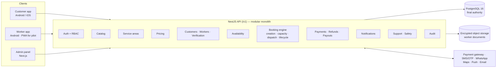
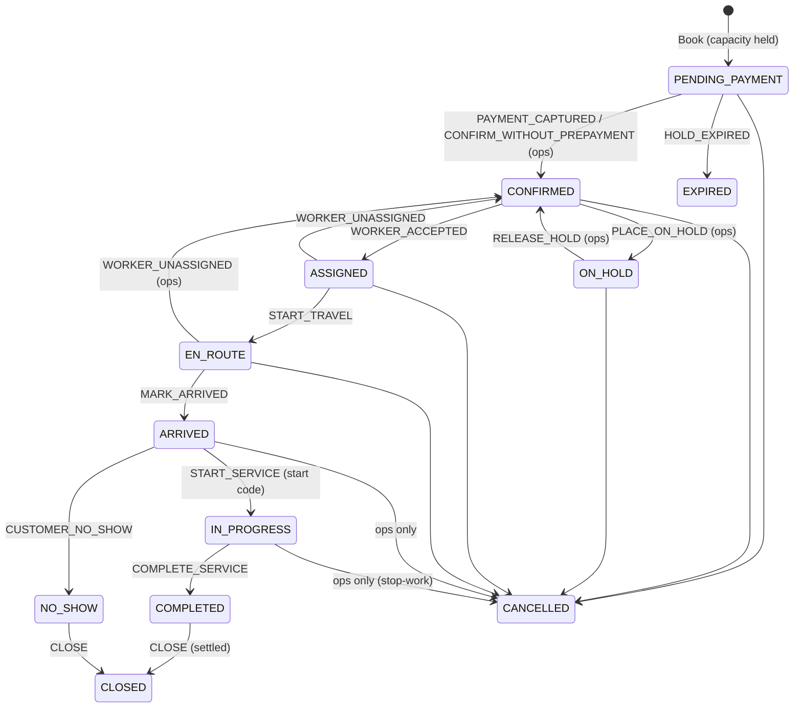

# One Tappe — System Design

Status: **v0.2 — core booking engine implemented**
Launch: **Noida**, first live service **HH60 (House Help, 60 minutes)**.
Operating rules come from the pilot playbook (_One Tappe Pilot — Start Here_, 22 Sep 2026);
page references like `V09` / `A13` point into that PDF.

---

## 1. Decisions

| #   | Decision                                                                                                                                                      | Consequence in the code                                                                                                                                      |
| --- | ------------------------------------------------------------------------------------------------------------------------------------------------------------- | ------------------------------------------------------------------------------------------------------------------------------------------------------------ |
| D1  | Customers self-book in the app from day 1. Operations can also book on a customer's behalf.                                                                   | `booking.source` is `CUSTOMER_APP` or `ADMIN`; `created_by_user_id` records the staff member.                                                                |
| D2  | WhatsApp and phone are support channels, not the booking system.                                                                                              | No booking state lives in chat; messages are sent from the notification module.                                                                              |
| D3  | Services are data. HH60 is simply the first row switched on.                                                                                                  | `service_category`, `service`, `service_option`, `service_task`, `service_zone`, verification and training requirements.                                     |
| D4  | Areas are data: city → zone → locality → pincode, plus a zone service radius. Noida is not in the code.                                                       | `serviceable_locality` view + `ServiceabilityService`.                                                                                                       |
| D5  | Prices are rules: service, option, city, zone, weekday, time of day, tax, charges, promo codes. Worker payout rules are separate.                             | `price_rule`, `charge_rule`, `tax_rate`, `promotion`, `payout_rule`; arithmetic in `@onetappe/domain`.                                                       |
| D6  | Modular monolith: one NestJS API, one PostgreSQL database.                                                                                                    | `apps/api` with feature modules.                                                                                                                             |
| D7  | The API is independent of any frontend so native Android/iOS apps, a PWA and the Next.js admin panel all use the same endpoints.                              | Versioned REST under `/v1`; auth, errors and money formats are client-neutral (see §8).                                                                      |
| D8  | **The database is the final authority** on availability, status changes and history. Frontend and service checks are for good error messages only.            | Exclusion constraints, triggers and append-only tables (see §5–§6). Verified by tests that bypass the application.                                           |
| D9  | English and Hindi from the start; more Indian languages without code changes.                                                                                 | `locale` table, `translation` table, per-locale notification templates, `app_user.preferred_locale`.                                                         |
| D10 | Production accounts (cloud, database, payment gateway, SMS, WhatsApp, maps, push, email, monitoring) belong to the company. Developers get role-based access. | Secrets come from environment/secret manager only; nothing in the repository.                                                                                |
| D11 | SQL-first migrations (plain `.sql` files) with typed queries via Kysely instead of an ORM.                                                                    | We rely on PostgreSQL features ORMs do not model (exclusion constraints, range types, triggers). Types are generated from the live schema and checked in CI. |

---

## 2. Architecture



### Repository layout

```
apps/api/                 NestJS API
  migrations/             0001…0010 forward-only SQL migrations
  src/database/           connection, transactions with action context, error mapping, generated types
  src/booking/            booking engine
  src/pricing/            rule loading → @onetappe/domain arithmetic
  src/service-area/       serviceability
  test/                   integration tests against a real PostgreSQL
packages/domain/          framework-free rules shared by every client
  booking/                statuses and the state machine
  pricing/                rule selection, quote calculation
  capacity/               reservation periods, daily capacity maths
  money/, time/           paise arithmetic, India-time helpers
docs/                     this design, screen map, open items
infra/                    local docker-compose
.github/workflows/ci.yml  format, lint, typecheck, build, migrate, codegen check, tests
```

---

## 3. Roles and data access

Replaced in milestone 2 (migration `0011`) by eight staff roles with granular permissions. No role
holds every permission.

The roles are `SUPER_ADMIN`, `OPERATIONS_HEAD`, `DISPATCHER`, `CUSTOMER_SUPPORT`,
`WORKER_OPERATIONS`, `FINANCE`, `SAFETY` and `AUDITOR`. Each can be limited to one city.

See [04-api-and-security.md §4–5](04-api-and-security.md#4-roles-and-permissions) for:

- the role matrix;
- masking;
- audited PII reveal;
- step-up MFA for sensitive actions.

**Separation of duties enforced by the database:**

- Nobody approves their own refund, payout, worker bank change, verification or restriction
  lift.
- Serious safety incidents are closed by someone other than the incident commander.

---

## 4. Data model

70 tables across ten migrations. Money is integer **paise**; rates are **basis points**; all
instants are UTC `timestamptz`, shown in the city's time zone.

| Migration                           | Tables                                                                                                                                                                                                                                                                                      |
| ----------------------------------- | ------------------------------------------------------------------------------------------------------------------------------------------------------------------------------------------------------------------------------------------------------------------------------------------- |
| `0001_foundation`                   | `audit_log`, `locale`, `translation`; action-context functions; protective trigger functions                                                                                                                                                                                                |
| `0002_service_areas`                | `city`, `zone`, `pincode`, `locality`; `serviceable_locality` view; `distance_m()`                                                                                                                                                                                                          |
| `0003_identity_access`              | `app_user`, `role`, `permission`, `role_permission`, `user_role`, `staff_credential`, `otp_challenge`, `auth_session`, `user_device`, `legal_document`, `consent_record`                                                                                                                    |
| `0004_catalog_pricing`              | `service_category`, `service`, `service_option`, `service_task`, `service_zone`, `tax_rate`, `price_rule`, `charge_rule`, `promotion`, `promotion_service`, `promotion_city`, `payout_rule`                                                                                                 |
| `0005_customers_workers`            | `customer_profile`, `address`, `worker_profile`, `worker_verification`, `service_verification_requirement`, `training_module`, `service_training_requirement`, `worker_training`, `worker_service_permission`, `worker_restriction`, `worker_bank_account`; `worker_ineligibility_reason()` |
| `0006_availability`                 | `worker_shift`, `worker_presence`, `worker_presence_event`                                                                                                                                                                                                                                  |
| `0007_bookings`                     | `booking_status_transition`, `booking`, `booking_status_history`, `booking_schedule_change`, `booking_price_line`, `booking_task`, `booking_verification_code`, `booking_rating`, `worker_reservation`, `booking_assignment`                                                                |
| `0008_payments`                     | `payment`, `payment_event`, `refund`, `invoice_sequence`, `invoice`, `credit_note`, `worker_payout`, `worker_earning`                                                                                                                                                                       |
| `0009_notifications_support_safety` | `promotion_redemption`, `notification_template`, `notification`, `support_case`, `support_case_event`, `safety_incident`, `safety_incident_event`                                                                                                                                           |
| `0010_truncate_guards`              | Statement-level guards: `TRUNCATE` is refused on history and financial tables                                                                                                                                                                                                               |

---

## 5. Booking lifecycle



The full table — which **channel** may trigger each event and whether a **reason** is required
— is `BOOKING_TRANSITIONS` in `packages/domain/src/booking/booking-state-machine.ts`. The same
rows are in the database table `booking_status_transition`; a test fails if they ever differ.

**Two layers, same rules.** `BookingTransitionService` checks the domain state machine first
(clear error messages), then updates the row. The `booking_before_update` trigger checks again
against the database table, the channel (`app.source`) and the reason (`app.reason`), and
`booking_after_write` writes the history row. A raw SQL update cannot skip either.

### History and promises

| Requirement                                                      | How it is guaranteed                                                                                                                                                      |
| ---------------------------------------------------------------- | ------------------------------------------------------------------------------------------------------------------------------------------------------------------------- |
| Who, when, what, previous → new, source, for every status change | `booking_status_history` row written by trigger with actor, role, source, reason, request id, timestamp.                                                                  |
| Original promise kept permanently                                | `original_start/original_end` are copied from the first schedule on insert; any later change raises `OT003`.                                                              |
| Every reschedule recorded                                        | `booking_schedule_change` row (previous → new, actor, source, reason) written by trigger; a reason is mandatory.                                                          |
| Price cannot be edited after booking                             | Identity, service, address snapshot and all price columns are immutable; the calculation is frozen in `booking_price_line`.                                               |
| Nothing important is deleted                                     | `DELETE` forbidden on bookings, assignments, reservations, payments, refunds, workers, verifications, …; history tables are append-only; `TRUNCATE` blocked.              |
| Every change to important records is auditable                   | `audit_log` rows with before/after JSON, changed fields, actor, source, request id; secrets (password hash, bank number, document keys, incident narrative) are redacted. |

---

## 6. Capacity and dispatch

### 6.1 The double-booking guarantee

```sql
CREATE TABLE worker_reservation (
  worker_id  uuid NOT NULL,
  period     tstzrange NOT NULL,          -- travel buffer + service + reset buffer
  status     text NOT NULL,               -- HELD | ALLOCATED | ACCEPTED | RELEASED
  ...
  CONSTRAINT worker_reservation_no_overlap
    EXCLUDE USING gist (worker_id WITH =, period WITH &&)
    WHERE (status IN ('HELD', 'ALLOCATED', 'ACCEPTED'))
);
```

Two transactions reserving the same worker for overlapping time cannot both commit; PostgreSQL
makes the second wait and then fail with `23P01`. The booking engine treats that as "this worker
was just taken" and tries the next candidate inside a savepoint.

When both inserts are checking each other's uncommitted row at the same instant, PostgreSQL
may instead abort one as a deadlock (`40P01`). `inTransaction` retries deadlocks and
serialization failures (up to 4 attempts, with jitter). The retry sees the winner's committed
reservation and moves on to the next worker, or reports `NO_AVAILABILITY`, so the customer never
gets a server error. This case was seen once in CI; a deterministic deadlock test now covers the
retry.

**Verified:** during development the constraint was temporarily removed and the concurrency
tests in `test/concurrency.test.ts` were re-run: 3 of 10 racing customers then got the same
single worker. With the constraint, exactly one succeeds. The application's own availability
check is therefore not enough on its own — the constraint is what protects customers.

The `worker_reservation_before_insert` trigger additionally refuses a reservation unless:

- the worker's status is `ACTIVE` (or `RESTRICTED` without a restriction on this service), and
  the worker is permitted for the service and zone;
- every verification the service requires is `VERIFIED` in its latest attempt and still valid
  when the job ends; every required training module is passed;
- a planned shift in the booking's zone covers the whole period;
- the period covers the booked service time.

Expired payment holds are released inside the same trigger, so an abandoned checkout never
blocks the next customer even before the sweeper runs.

### 6.2 Reservation states

| Status      | Meaning                                                             |
| ----------- | ------------------------------------------------------------------- |
| `HELD`      | Customer is paying; expires at `booking.payment_due_by`.            |
| `ALLOCATED` | Booking confirmed; the worker has been offered the job.             |
| `ACCEPTED`  | The worker accepted.                                                |
| `RELEASED`  | No longer blocks time (cancelled, expired, declined, rescheduled…). |

### 6.3 Flow

```mermaid
sequenceDiagram
    participant C as Customer app
    participant API
    participant DB as PostgreSQL
    participant W as Worker app

    C->>API: Book HH60 (service, option, address, time, promo, expected total, idempotency key)
    API->>DB: price rules → quote; insert booking (PENDING_PAYMENT)
    API->>DB: HELD reservation for an eligible free worker
    DB-->>API: ok (or 23P01 → try next worker; none → NO_AVAILABILITY, nothing saved)
    API-->>C: booking code, total, pay by
    C->>API: pay (gateway)
    API->>DB: PAYMENT_CAPTURED → CONFIRMED; HELD → ALLOCATED; offer (expires in 3 min)
    API-->>W: job request (limited details)
    W->>API: accept
    API->>DB: offer ACCEPTED; reservation ACCEPTED; booking ASSIGNED
    W->>API: start travel · arrived · start code · complete
    API->>DB: EN_ROUTE · ARRIVED · IN_PROGRESS · COMPLETED
    API->>DB: settlement → CLOSED
```

Declined or unanswered offers release that worker's reservation, and the next eligible worker
(never one who already declined this booking) is reserved and offered. If nobody is left, the
result reports `unfilledCrewSlots` so operations can act. Crew services (`workers_required > 1`)
use the same code with one reservation and one offer per crew slot.

### 6.4 Start code

The 4-digit start code is derived with HMAC from a server secret and the booking id, so it is
never stored in clear text. The customer app displays it; the worker enters it. Wrong attempts
are committed even though the request fails, and the code locks after five. Operations may
start a job without a code only with a written reason, which is stored in the history.

---

## 7. Pricing

- **Customer price:** the applicable `price_rule` is chosen by priority → specificity (option,
  zone, city, weekday, time of day) → newest; charges (`charge_rule`, e.g. instant booking,
  evening) are added; a promo code is validated (dates, service/city scope, total and per-user
  limits, first-booking-only) with the promotion row locked so the last redemption cannot be
  used twice; GST is applied to the taxable value after discount.
- **Price-changed protection:** the app sends the total it showed; if the server's total differs,
  the booking is refused with `PRICE_CHANGED`.
- **Worker payout:** `payout_rule` uses the same scoping but is independent of the customer price.

---

## 8. API conventions (for Android, iOS and web alike)

- **Paths.** Base path `/api/v1`. Breaking changes go to `/api/v2`, and old app versions keep
  working.
- **Data format.** JSON only. Money is integer paise plus a currency. Times are ISO-8601 UTC.
- **Errors.** `{ "error": { "code": "NO_AVAILABILITY", "message": "…", "details": {}, "requestId": "…" } }`.
  Apps switch on `code`; `message` is for logs and as a fallback.
- **Idempotency.** Every creating request from the apps carries an `Idempotency-Key`, so a retry
  on a flaky mobile network never creates two bookings, payments or cases.
- **Transactions.** Every mutating request runs in one transaction with an action context (actor,
  role, source, request id, reason). The database writes that context into history and audit
  rows.
- **Business rules live in the API.** Apps show what the API returns; they never decide
  availability, prices, eligibility or status changes.

The full endpoint list, the authentication design and the integrations are in
[04-api-and-security.md](04-api-and-security.md).

---

## 9. What is built vs next

| Area                                                                           | Status                                                                         |
| ------------------------------------------------------------------------------ | ------------------------------------------------------------------------------ |
| Monorepo, CI (6 required-able jobs), lint, typecheck, formatting               | Done                                                                           |
| Database schema, migrations 0001–0013                                          | Done                                                                           |
| Booking state machine (domain + database)                                      | Done, tested                                                                   |
| Concurrency protection, eligibility, shift checks, deadlock retry              | Done, tested (incl. mutation checks)                                           |
| Booking creation, dispatch, lifecycle, start code                              | Done, tested                                                                   |
| Customer/worker OTP auth, staff password + TOTP, sessions, RBAC, PII masking   | Done, tested                                                                   |
| Worker lifecycle (REGISTERED → ACTIVE, suspension, restriction)                | Done, tested                                                                   |
| Customer, worker and admin APIs under `/api/v1`                                | Done; acceptance and failure journeys pass over HTTP                           |
| Payments: provider abstraction, Razorpay adapter, signed sandbox, webhooks     | Done with the sandbox; Razorpay adapter not yet run against Razorpay test mode |
| Refunds, cancellation policy, invoices, worker earnings                        | Done, tested                                                                   |
| Background worker (expiry, offers, re-dispatch, notifications, reconciliation) | Done, tested                                                                   |
| Notifications outbox and en/hi templates                                       | Done; senders are log-only until provider accounts exist                       |
| OTP via MSG91                                                                  | Adapter written; not yet run against an MSG91 account                          |
| Document storage for production (S3-compatible)                                | **Next**; production start is refused until it exists                          |
| Admin APIs to edit catalog, areas, prices, payout rules                        | **Next** (configured by SQL/seed for now)                                      |
| Cash payment recording                                                         | **Next**                                                                       |
| Customer app, worker app, admin panel                                          | **Next milestone**                                                             |
