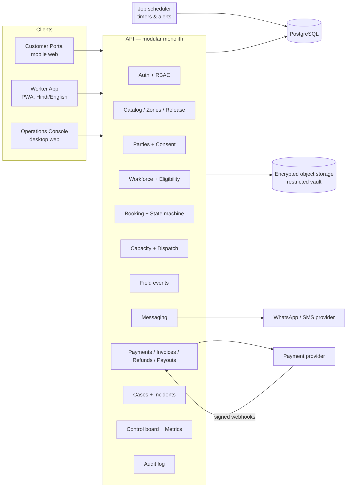
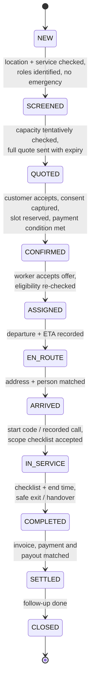
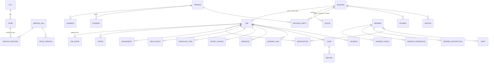

# One Tappe — System Design (Bokaro Pilot)

Status: **DRAFT v0.1 — for review before any code is written**
Source: *One Tappe / Bokaro Pilot — Start Here (Visual Edition, 22 Sep 2026)* and its
appendix *Bokaro Operating Playbook v1.0*. Page references below use the PDF's own
labels: `V01–V28` (visual guide) and `A01–A43` (appendix).

---

## 1. What we are building

A **controlled job register** with three front-ends, built around one rule from the
playbook (A02):

> Every accepted job has **one owner, one confirmed scope, one capacity reservation,
> one check-in/out record and one settlement record.**

WhatsApp and phone stay the *conversation* channels. The system is the *operational
record* (V22, A07). A chat screenshot can never be the only record of an accepted job.

| Front-end | Who uses it | Device | Purpose |
|---|---|---|---|
| **Operations Console** | Dispatch/Support, City Lead, Safety Officer, Finance, Founder | Desktop / laptop (company device) | Intake → quote → reserve → assign → monitor → settle → close. The heart of the pilot. |
| **Worker App** (PWA) | Helpers, attendants, crew leads | Android phone, Hindi-first, poor network | Accept offers, job brief, check-in/out, start code, checklist, scope change, SOS/stop-work, earnings. |
| **Customer Portal** | Payer, recipient, authorised contact | Any phone browser, opened from a WhatsApp/SMS link | Enquiry, quote review + acceptance + consent, payment, booking tracker, start code, completion review, concerns. |

### 1.1 Release phases (follows the rollout on V27 / A35)

| Phase | Services | Why this order |
|---|---|---|
| **Phase 1 — Pilot core** | `HH60` house help only | The playbook opens house help first (days 12–14). Every shared module (booking, dispatch, money, cases) is proven on the simplest service. |
| **Phase 2 — Care & crews** | `PC120` companion, `HE240` hospital escort, `DC-S` deep cleaning, `SUB26` subscription | Each needs extra records (consent roles, care brief, handover, survey, crew reservation, visit ledger). Each opens behind its own GO/HOLD gate. |
| **Phase 3 — Ambulance coordination** | `AMB` | Needs partner/vehicle/shift readiness records and the Form D timeline. Hold until the legal/clinical gates close (A40). |

Nothing in Phase 2/3 is thrown away work: the data model below already has the
places those services plug into.

---

## 2. Architecture

The playbook says: *"Use a single controlled backend and database before adding
architectural complexity. Enforce permissions server-side."* (A25). So the design is a
**modular monolith**: one API process, one PostgreSQL database, clearly separated
modules inside.



### 2.1 Recommended stack (to be confirmed — see open questions)

| Layer | Choice | Reason |
|---|---|---|
| Language | **TypeScript** everywhere | One language for API, web and shared domain rules (state machine, validation). |
| API | **NestJS** (Node 22 LTS) | Module boundaries, dependency injection, guards for RBAC, well-known structure for a team to maintain. |
| Database | **PostgreSQL 16** | Transactions, `EXCLUDE` constraints to make double-booking impossible at the database level, row-level security as a second line of defence, append-only triggers. |
| ORM / migrations | **Prisma** + hand-written SQL migrations for constraints/triggers | Typed queries; SQL where Prisma cannot express the guarantee. |
| Background jobs | **pg-boss** (queue inside Postgres) | Offer timers, alerts and reminders without adding Redis in the pilot. |
| Web apps | **Next.js** (React) — one app, three route areas: `/` customer, `/w` worker, `/ops` console | Shared design system; server rendering for customer links; PWA for workers. |
| UI kit | Tailwind CSS + Radix UI primitives, own design tokens | Accessible components, consistent theming, no heavy vendor lock-in. |
| i18n | `next-intl`, Hindi + English from day one | Worker instructions must be in a language they understand (A03, A09). |
| Validation | **Zod** schemas in a shared package | Same rules in browser and server. |
| Testing | Vitest (unit), Testcontainers Postgres (integration), Playwright (end-to-end) | Acceptance checks from A25 become automated tests. |
| Hosting | India region (e.g. AWS `ap-south-1` Mumbai) | Data residency expectations; CERT-In ICT logs retained 180 days in India (A26). |
| Files | S3-compatible storage, server-side encryption, signed short-lived URLs | Restricted vault for ID/consent/incident evidence (V22). |

### 2.2 Repository layout (proposed)

```
onetappe/
├─ apps/
│  ├─ api/              NestJS API (modules listed in §4)
│  └─ web/              Next.js: customer (/), worker (/w), ops console (/ops)
├─ packages/
│  ├─ domain/           state machine, enums, pricing/capacity maths, Zod schemas
│  ├─ ui/               design tokens + shared components
│  └─ config/           tsconfig, eslint, prettier presets
├─ infra/               docker-compose for local dev; IaC later
├─ docs/                this design, screen map, ADRs, runbooks
└─ .github/workflows/   CI: lint, typecheck, test, build
```

---

## 3. Roles and permissions

Roles come from V04 / A08; data boundaries from V23 / A25. Permissions are enforced in
the API (guards + query scoping), with PostgreSQL row-level security as a second layer
on the most sensitive tables.

| Role | Can do | Must NOT see / do |
|---|---|---|
| `FOUNDER` | Budget, service scope, GO/HOLD approvals, management reports, logged exceptional access | Waive a safety stop or expired credential; routine PII exports |
| `CITY_LEAD` | Live queue, capacity, stop-sell, remedies, replacements, shift handover, approve refunds up to a limit | Approve own requests |
| `DISPATCHER` (Dispatch/Support) | Intake, quote, reserve, offer/assign, check-ins, customer updates, own cases | Full ID scans, unrelated health history, bank details |
| `SAFETY_OFFICER` | Worker verification, restrictions, incidents, care brief review | Accounting data beyond the case |
| `FINANCE` | Invoices, payments, reconciliation, payouts, refund initiation | Care narratives, medical reports, incident narratives |
| `WORKER` | Own offers and assigned jobs only, necessary address/access, own earnings | Other customers, other workers, bulk export |
| `TECH_ADMIN` | User accounts, configuration, backups | Business data except through logged break-glass |

**Separation-of-duties rules enforced in code and database:**
- Refund: `approved_by ≠ requested_by` (A08, V20).
- Worker bank-detail change: `approved_by ≠ changed_by`.
- Lifting a worker restriction: reviewer ≠ the person who imposed it; must reference evidence.
- Closing a critical/high incident: independent approver.

Every read of restricted data (vault files, care brief, incident narrative) writes an
audit record.

---

## 4. Modules and responsibilities

| Module | Owns | Key rules |
|---|---|---|
| **auth** | Staff login (password + TOTP MFA), worker/customer phone OTP, sessions, device registration | No shared accounts; access removed on exit (A26) |
| **catalog** | Service SKUs, task lists, price versions, tax lines, terms versions | Prices and terms are versioned; a quote references exact versions |
| **coverage** | Cities, zones (polygon / approved streets / pincodes), zone hours, route buffer, exclusions | A zone is `DRAFT` until released with a date and supervisor (V05) |
| **release** | Service release register: service × zone × hours × capacity → `GO` / `HOLD`, conditions, approvers, review date | No booking can be confirmed for a service/zone that is not `GO` (V24, A40) |
| **parties** | Persons, customer accounts, addresses, roles on a job (payer / recipient / authorised contact / backup) | Payer and recipient are separate records (V11) |
| **consent** | Consent records: purpose, terms version, time, method, withdrawal | Service consent separate from marketing; withdrawal is practical (A30) |
| **workforce** | Workers, activation checks with expiry, service × zone permissions, restrictions, shifts, rate card | Expired check or active restriction blocks assignment (A25) |
| **booking** | Enquiries, bookings, jobs, quotes, the job state machine, append-only job events | Original promised window never overwritten (A12) |
| **capacity** | Slot inventory, reservations, 80% bookable cap, stop-sell flags | Overlapping reservations impossible (DB constraint) |
| **dispatch** | Offers with expiry, acceptance, assignment, reassignment | One active assignment per job; one pending offer per worker-slot |
| **field** | Departure/arrival/start/end/safe-exit events, start code, checklist, scope changes, SOS | Events carry `occurred_at` (device time) and `recorded_at` (server time) for offline sync |
| **messaging** | Template library (V18), rendered messages per job, "next update due" timer | Estimates labelled as estimates; payment OTP never used as a start code |
| **payments** | Payment links, provider webhooks, invoices, credit notes, refunds, worker earnings & payouts, daily reconciliation | Webhook signature verified; provider event IDs unique (dedup); no stored-value wallet (A23) |
| **cases** | Complaints / support cases, remedies, appeals | One case, one owner, next-update time (V20) |
| **incidents** | Safety incidents (CRITICAL / HIGH / ROUTINE), actions, restricted narrative, review | Danger bypasses every queue; closure needs independent approval (V19) |
| **ops** | Shift open/close checklists, control board queries, metrics | Metrics never change denominators silently (V26) |
| **audit** | Immutable audit log of writes and sensitive reads | Retained ≥180 days in India |

---

## 5. Booking lifecycle

### 5.1 Main states (V08, A12)



### 5.2 Side states

| State | Allowed from | Required data |
|---|---|---|
| `CANCELLED` | NEW … EN_ROUTE | initiator (customer / One Tappe), reason, time, refund decision |
| `NO_SHOW` | ASSIGNED, EN_ROUTE, ARRIVED | who did not show (worker / customer no access), contact attempts |
| `RESCHEDULED` | QUOTED … ASSIGNED | link to the **new** job; old job keeps its original promise |
| `ON_HOLD` | SCREENED, QUOTED, CONFIRMED | owner, reason, expiry time |

**Design decision (please confirm):** the PDF also lists `INCIDENT_OPEN` and
`REFUND_PENDING` as side states. In the system they are **flags derived from linked
open records** (an open incident / a pending refund), not lifecycle states. Reason: a
job can be `COMPLETED` *and* have a pending refund; turning the refund into a state
would erase where the job actually is. The control board still shows both queues.

### 5.3 Transition rules

- All transitions go through **one function** in `packages/domain` that checks: allowed
  from→to, actor role, and guard conditions (e.g. `QUOTED→CONFIRMED` requires an
  accepted quote, required consents, and a `LOCKED` reservation).
- Each transition writes a `job_events` row: previous state, new state, actor,
  `occurred_at` (UTC), `recorded_at`, reason, evidence reference. Displayed in IST.
- `job_events` is **append-only** (database trigger rejects UPDATE/DELETE).
- Jobs are never deleted. Failed/unserved bookings remain for honest metrics.
- Reschedule creates a new job with `rescheduled_from_job_id`.

---

## 6. Capacity and dispatch

### 6.1 Slot inventory (V05, V09, A13)

For each worker and day: `shift window − breaks/admin = workable minutes`.
Bookable minutes = `workable × 0.80` (20% recovery reserve, configurable per zone).
A job block = `service duration + travel buffer + reset` (e.g. HH60 = 60 + 20 + 10 = 90 min).

Worked example from the playbook, which becomes a unit test:
`5 workers × (480 − 60) = 2,100 min → × 0.8 = 1,680 → floor(1,680 / 90) = 18 jobs/day`.

Customers are shown **only windows that fit** at least one eligible worker. When no
window fits, the portal offers a later slot or waitlist — never a paid order on hope
(V05 "stop sales when slots run out").

### 6.2 Making double-booking impossible

```sql
-- sketch, final form in migrations
CREATE TABLE reservation (
  id           uuid PRIMARY KEY,
  worker_id    uuid NOT NULL REFERENCES worker(id),
  job_id       uuid NOT NULL REFERENCES job(id),
  period       tstzrange NOT NULL,      -- includes travel + reset
  status       reservation_status NOT NULL, -- HELD | LOCKED | RELEASED
  hold_expires_at timestamptz,
  EXCLUDE USING gist (worker_id WITH =, period WITH &&)
    WHERE (status IN ('HELD','LOCKED'))
);
```

Two dispatchers clicking at the same time cannot both succeed; the second gets a
clear "slot just taken" message.

### 6.3 Assignment sequence (A13)

1. **Filter** — active status, permission for this SKU and zone, all required checks
   valid on the job date, on shift, no restriction, no overlapping reservation.
2. **Rank** — recurring customers' regular worker first, then travel time and load.
3. **Offer** — a `HELD` reservation + offer to one worker with scope, pay and travel.
4. **Accept** within 3 min → reservation `LOCKED`, job `ASSIGNED`. No reply → offer
   expires, hold released, next worker.
5. **No accepted worker in 10 min** → alert dispatcher; customer told "unconfirmed",
   offered later slot or refund.

### 6.4 Timers (proposed values from the PDF, all configurable)

| Timer | Default | On expiry |
|---|---|---|
| Human first response (staffed hours) | 5 min | Escalate to backup dispatcher |
| Worker offer acceptance | 3 min | Release offer, try next |
| No accepted worker | 10 min | Alert + customer "unconfirmed" message |
| Quote expiry | per quote | Release tentative hold |
| Arrival window at risk | before window closes | Prompt dispatcher to send delay message |
| Missed check-in | 2 calls over 5 min | Contact customer + Safety Officer |
| Next customer update due | set per message | Reminder on control board |
| Credential expiry | 14 / 7 / 1 day before | Alert Safety; block on expiry |
| HE240 block ending | 30 min before end | Extension / replacement decision |

---

## 7. Data model (Phase 1 tables, Phase 2/3 marked)

All IDs are UUIDs; human-readable job codes like `OT-BKR-000123`. All money is stored in
**paise** as integers. All times stored in UTC, shown in IST.



### 7.1 Tables

**Catalog & coverage**
- `city` — code, name, timezone.
- `zone` — city, code, name, status (`DRAFT|RELEASED|SUSPENDED`), boundary (GeoJSON / street list / pincodes), hours, route buffer, exclusions, supervisor, revision, released_at.
- `service_sku` — code (`HH60`, `PC120`, `HE240`, `DC_S`, `SUB26`, `AMB`), name, duration, crew size, included tasks, exclusions, requires_care_screen.
- `price_version` — sku, zone (nullable), net price, tax lines, effective from/to, approved_by.
- `terms_version` — kind (customer terms, privacy notice, care consent, worker terms), version, content hash, published text/URL, effective from.
- `service_release` — sku × zone × hours × daily capacity, status `GO|HOLD`, conditions, evidence refs, approvers, decided_at, review_date.
- `stop_sell` — sku/zone/date window, reason, set_by, cleared_by.

**Parties & consent**
- `person` — name, phone, preferred language, (no Aadhaar number stored).
- `customer_account` — person, login phone, status.
- `address` — person, house/flat, street, landmark, pincode, lat/lng pin, zone, access notes (gate, lift, stairs, parking, pets), verified_by/at.
- `booking_party` — booking, person, role (`PAYER|RECIPIENT|AUTHORISED_CONTACT|BACKUP_CONTACT`).
- `consent` — person, booking (nullable), purpose (`SERVICE|INFO_SHARING|PHOTOS|LOCATION|MARKETING`), terms_version, granted_at, method (portal click / recorded call / signed form), recorded_by, withdrawn_at.

**Booking**
- `enquiry` — channel (WhatsApp / phone / portal), raw need, emergency-screen answer, created_by. One enquiry can create several bookings.
- `booking` — enquiry, sku, zone, address, status summary, owner (accountable dispatcher), created_by.
- `job` — booking, sequence, job_code, state, **original_window_start/end (immutable after CONFIRMED)**, current_eta (labelled estimate), scope (task priorities, versioned JSON), rescheduled_from_job_id, owner.
- `job_event` — append-only log (see §5.3).
- `quote` — booking, version, line items, net, tax, total, extras basis, cancellation/refund terms version, expires_at, sent_at, accepted_at, accepted_by, acceptance method.

**Workforce**
- `worker` — person, company worker ID, status (`APPLICANT|IN_VERIFICATION|SUPERVISED|ACTIVE|RESTRICTED|INACTIVE`), languages, home zone.
- `worker_check` — type (`AGE|IDENTITY|ADDRESS|EMERGENCY_CONTACT|POLICE|REFERENCE|FITNESS|SKILL|TRAINING|CONTRACT|BANK|SUPERVISED_VISIT|INCIDENT_DRILL`), result, verifier, verified_at, expires_at, vault_document (restricted).
- `worker_permission` — worker, sku, zone, granted_by, valid_until.
- `worker_restriction` — worker, scope (sku/zone/all), reason, evidence, imposed_by, review_date, lifted_by, lift_reason.
- `shift` — worker, date, start, end, breaks, zone, pre-shift readiness answers.
- `reservation`, `offer`, `assignment` — see §6.

**Field**
- `field_event` — job, worker, type (`DEPARTED|ARRIVED|START|CHECK_IN|END|SAFE_EXIT|SOS|STOP_WORK`), occurred_at, recorded_at, method, optional location (duty-only).
- `start_code` — job, code hash, issued_at, used_at, attempts.
- `checklist_item` — job, task, status (`DONE|NOT_DONE|DISPUTED`), note.
- `scope_change` — job, description, extra minutes, extra price, customer_approved_at, desk_approved_by.

**Money**
- `payment` — booking, provider, provider order/payment IDs (**unique**), amount, status.
- `payment_event` — provider event ID (**unique**, dedup), signature verified, payload, processed_at.
- `invoice` / `invoice_line` / `credit_note` — sequential numbering per issuing entity.
- `refund` — case, amount, reason, requested_by, approved_by (≠ requested_by), provider ref, initiated_at, expected settlement, status.
- `earning_line` — worker, job, type (`JOB_PAY|TRAVEL|WAITING|INCENTIVE|DEDUCTION`), amount, reason, status; `payout` — batch, paid_at, reference.
- `reconciliation_run` — date, checks performed, discrepancies, reviewed_by (second person).

**Support & safety**
- `case` — job, type, severity, desired remedy, owner, next_update_at, status, resolution, appeal.
- `incident` — severity, job, exact location, callback, commander, restricted narrative, actions, review_at, closed_by, reactivation approval.

**Operations & audit**
- `desk_shift_log` — opened_by, checklist answers, closed_by, handover notes.
- `message` — job, template code, channel, rendered text, sent_by, sent_at, next_update_due_at.
- `audit_log` — actor, action, entity, entity id, before/after (for writes), IP/device, time.

**Phase 2 additions:** `care_brief`, `care_screen_answers`, `handover`, `expense_cap`/`expense`, `survey` (deep clean), `crew_assignment`, `subscription` + `subscription_visit_ledger`.
**Phase 3 additions:** `ambulance_operator`, `vehicle`, `vehicle_check`, `vehicle_shift`, `ambulance_trip` (Form D timeline).

---

## 8. Payments and money

- **Pilot model:** company quote → company payment link (e.g. Razorpay / Cashfree) → company invoice. Cash only with numbered receipts (A23).
- **Webhooks:** verify signature → insert `payment_event` with unique provider event ID
  (a repeat is ignored) → update `payment` inside one transaction. A retried request can
  never double-charge (A25 acceptance check).
- **Refunds:** requested by support, approved by a different person, initiated to the
  original method, target initiation within 2 working days, settlement estimate shown
  honestly (V20).
- **Worker earnings:** written rate card; each completed job produces earning lines;
  earned pay is never withheld because of an unrelated dispute (A10, V20).
- **Daily reconciliation screen** (V21): jobs ↔ invoices ↔ provider ↔ bank ↔ worker dues
  ↔ refunds ↔ signed exceptions, reviewed by a second person.
- **Subscriptions (Phase 2):** advance received and undelivered visits tracked as an
  obligation; monthly check `opening + purchased − delivered − refunded = closing` (V17).

---

## 9. Messaging

Pilot: the console renders the correct template (V18) for the job and the dispatcher
sends it with one click through WhatsApp click-to-chat or copies it; the send is logged
on the job. Later: WhatsApp Business Cloud API with approved templates.

| # | Template | Trigger |
|---|---|---|
| 1 | Enquiry received — *"This is not confirmed yet"* | NEW |
| 2 | Quote (one message: provider, tasks, duration, window, full price incl. tax, extras, cancellation/refund, grievance contact, acceptance link) | QUOTED |
| 3 | Confirmed (booking ID, tasks, window, total, worker first name + company ID, start-code rule, support number) | CONFIRMED / ASSIGNED |
| 4 | Delay / change (what changed, estimate labelled as estimate, options, next update time) | Window at risk |
| 5 | Care update (factual; only to authorised contact) | Phase 2 |
| 6 | Completed (checklist outcome, invoice/receipt, how to raise a concern) | COMPLETED |
| 7 | Follow-up | After completion |
| — | Out-of-hours / emergency guidance: *call 112 or 108 now* | Any message outside staffed hours |

---

## 10. Security, privacy and continuity

- Staff: named accounts, password + TOTP MFA, short sessions on company devices.
- Workers/customers: phone OTP; worker sessions bound to a registered device.
- Least-privilege queries: workers can only query their own jobs; address is released to
  a worker only after they accept, and access is revoked when the job closes (A25).
- Restricted vault: ID, police, fitness, consent forms, incident evidence. Encrypted,
  never in the dispatch view, every access logged.
- No Aadhaar numbers stored; store *verification method, verifier, date, result* (A09, A30).
- Location only during duty and only for the job; no permanent route history (A26).
- Backups: encrypted daily + point-in-time recovery; **restore tested** before launch.
  Targets to test: RTO 4 h, RPO 1 h (V23).
- **Manual fallback:** a printable, access-controlled "active jobs + emergency list" export,
  and a backfill screen that records manual events with their original times (V23).
- Secrets in a secrets manager, never in code or chat. Synthetic data only in tests.
- AI (if ever used) may *draft* messages for review; it must not triage emergencies or
  decide care suitability (A25).

---

## 11. Acceptance checks → automated tests

From A25, each becomes a named test that must pass in CI:

| # | Check | Test type |
|---|---|---|
| 1 | Unauthorised role cannot read a record | API integration, per role |
| 2 | Expired credential blocks assignment | Integration |
| 3 | Retry cannot double-charge | Webhook replay integration |
| 4 | Cancellation releases capacity | Integration |
| 5 | Safety ticket reaches backup when primary does not respond | Scheduler integration |
| 6 | Restore recovers active jobs | Scripted restore drill (pre-launch) |
| 7 | Job closure revokes worker's access to address | Integration |
| + | Two simultaneous assignments for one slot → exactly one succeeds | Concurrency integration |
| + | Original promised window unchanged after ETA updates | Unit + integration |
| + | `job_events` cannot be updated or deleted | DB integration |
| + | Capacity example = 18 jobs/day | Unit |

---

## 12. Build milestones (Phase 1)

| # | Milestone | Done when |
|---|---|---|
| M0 | Foundations: monorepo, CI, Docker Postgres, lint/format/typecheck, auth + RBAC, audit log | CI green; role test matrix passes |
| M1 | Catalog, zones, prices, terms, service release register | A booking cannot be confirmed unless release is `GO` |
| M2 | Parties, addresses, consent; workers, checks, permissions, restrictions, shifts | Worker eligibility query correct incl. expiry |
| M3 | Enquiry → booking → job, state machine, quotes, event log | All transitions tested; append-only enforced |
| M4 | Capacity, reservations, offers, timers, control board | Double-booking impossible; timers fire |
| M5 | Worker app: HH60 field flow, start code, checklist, scope change, SOS | End-to-end job on a phone |
| M6 | Payments, invoices, refunds with approval separation, earnings, reconciliation | Webhook replay safe; reconciliation balances |
| M7 | Cases, incidents, follow-up, message templates | Complaint/incident flows per V19–V20 |
| M8 | Customer portal: enquiry, quote accept + consent, pay, tracker, review, concern | Customer can complete a booking from a link |
| M9 | Ops: desk shift open/close, metrics, exports, backup/restore drill, simulation data | Rehearsal cases from A36 pass on staging |

Then Phase 2 (care, deep clean, subscription) and Phase 3 (ambulance), each behind its
own release gate.
