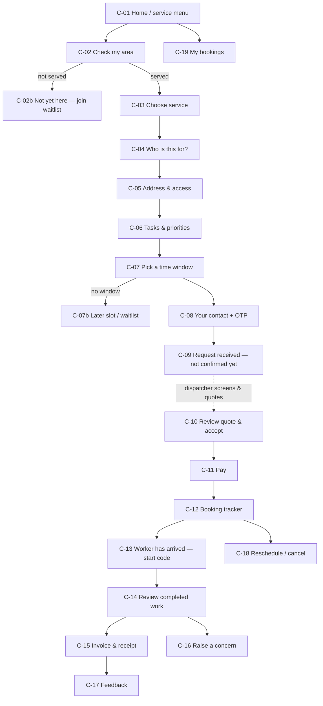
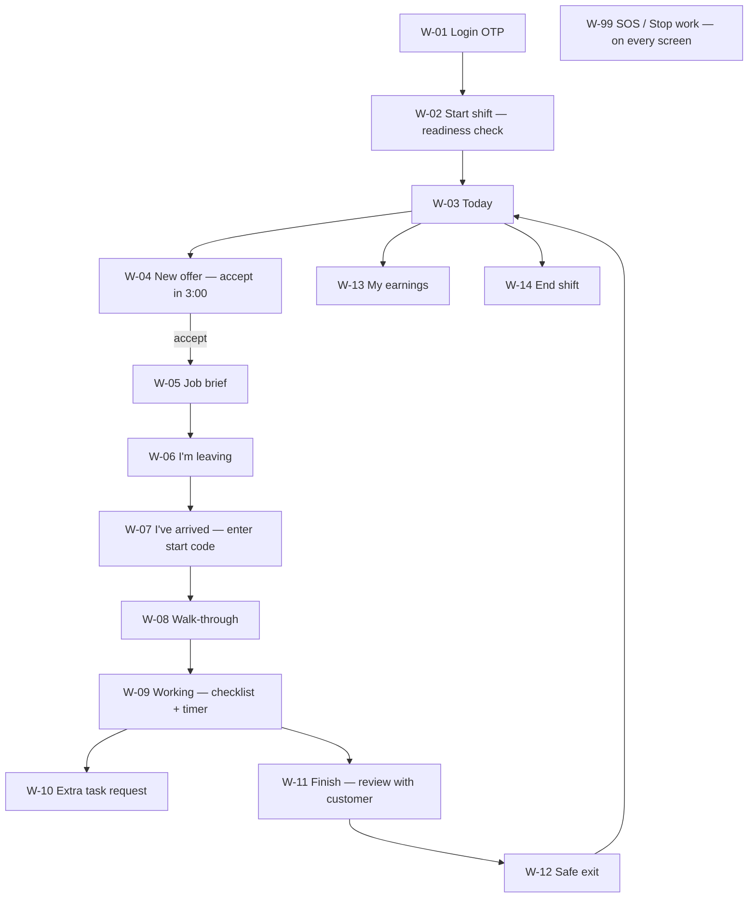

# One Tappe — UI/UX Screen Map (first page to full operations)

Status: **DRAFT v0.1 — for review**
Companion to [`01-system-design.md`](01-system-design.md). Screen IDs (`C-`, `W-`, `O-`) are
used in tickets, designs and tests so everyone refers to the same screen.

---

## 1. Design principles

These come straight from the playbook's rules and shape every screen.

1. **Honest status, always visible.** Every booking shows its state in plain words. Before
   confirmation the customer sees *"Not confirmed yet"*. Every ETA is labelled
   *"Estimate"*. The original promised window is shown next to any new estimate (V18, A12).
2. **Emergency is never behind a form.** Every customer and worker screen has a
   persistent *"Emergency? Call 112 / 108"* link. The ops intake starts with the danger
   question (V07, V15).
3. **One job, one page.** In the console, everything about a job lives on one screen,
   organised in the playbook's order: **Request → Promise → Delivery → Money →
   Follow-up** (V28), with the event history alongside.
4. **Only show what the role needs.** Workers see their job only; finance never sees care
   notes; restricted panels show a lock and log access (V23).
5. **Hindi-first for workers, bilingual for customers.** Big tap targets (≥48 px), icons
   with labels, short sentences, works on slow 3G, keeps working offline and syncs.
6. **Colour follows the PDF legend.** Green = proceed / handoff, amber = check / hold,
   red = safety / exception. Never colour alone — always an icon + text too.
7. **Accessible.** WCAG 2.2 AA contrast, screen-reader labels, phone fallback for anyone
   who cannot use forms (A26).

---

## 2. Customer Portal (mobile web, opened from WhatsApp/SMS link or website)



| ID | Screen | Key content | Rules shown in UI |
|---|---|---|---|
| C-01 | Home / service menu | Services available **in released zones only**, staffed hours, emergency banner, WhatsApp/call buttons | Only `GO` services listed; hours are the real staffed hours |
| C-02 | Check my area | Pincode + locality picker or map pin | Unserved area → C-02b waitlist with permission |
| C-03 | Choose service | Service cards: what's included, what's not, duration, price "from" | Exclusions visible before selection (A11) |
| C-04 | Who is this for? | Myself / a family member; if family: recipient name, phone, relationship | Care services later add recipient consent step |
| C-05 | Address & access | Map pin + house/flat + landmark; gate, lift, stairs, parking, pets | Pin **and** landmark required (A04) |
| C-06 | Tasks & priorities | Drag-to-order task list for HH60 | "60 minutes covers the tasks in this order — not a whole-house guarantee" |
| C-07 | Pick a time window | Only windows with real capacity; arrival window, not exact time | No slot → later date or waitlist; never "we'll try" |
| C-08 | Contact + OTP | Phone, OTP, language, privacy notice summary | Service consent separate from marketing opt-in |
| C-09 | Request received | Request ID, "We are checking… **This is not confirmed yet**", expected reply time | Emergency guidance repeated |
| C-10 | Review quote & accept | Provider identity, tasks, duration, window, net + tax = **total**, extras basis, cancellation/refund, grievance contact, quote expiry; consent checkboxes; **Accept** | Acceptance records terms version + time (A11) |
| C-11 | Pay | Payment link (UPI / card) if advance required | Never asks for PIN/OTP outside the provider page |
| C-12 | Booking tracker | Status timeline, original window, current estimate (labelled), worker first name + company ID + photo, support call | Shows "next update by HH:MM" when uncertain |
| C-13 | Start code | Large code to read out **only after** checking worker ID | "This is not a payment OTP" |
| C-14 | Review completed work | Checklist with done / not done; agree or dispute; photos only with permission | Disagreement stays visible to support |
| C-15 | Invoice & receipt | Downloadable invoice from the correct issuer | |
| C-16 | Raise a concern | Category, what happened, desired remedy, contact preference | Safety option routes straight to urgent handling |
| C-17 | Feedback | "Was the agreed service completed?" + rating | Rating never decides a worker's fate alone |
| C-18 | Reschedule / cancel | Current policy shown before action; refund estimate | Pilot: no cancellation fee before dispatch (A22) |
| C-19 | My bookings | Upcoming, past, open cases | |

---

## 3. Worker App (PWA, Hindi / English)



| ID | Screen | Key content | Rules |
|---|---|---|---|
| W-01 | Login | Phone + OTP on registered device | Inactive/restricted worker sees why and whom to call |
| W-02 | Start shift | Fit for work? Phone charged? Uniform & ID? Kit? | Answers logged; "No" alerts desk, not a penalty |
| W-03 | Today | Timeline of accepted jobs, next job highlighted, offline indicator | Only own jobs |
| W-04 | New offer | Service, area (not full address yet), time block, tasks, **pay**, travel time, countdown | Accept / Decline with reason; address revealed after accept |
| W-05 | Job brief | Address + landmark + map, access notes, task order, hazards, customer first name, desk number | Only the information the job needs |
| W-06 | Leaving | "I'm leaving now" → ETA | Sends departure event |
| W-07 | Arrived | Show your company ID → ask customer for start code (or desk confirms by call) | Never ask for a payment OTP |
| W-08 | Walk-through | Confirm task order, surfaces, products, pets secured, safe exit, pre-existing damage | Photos only with customer permission |
| W-09 | Working | Checklist ticks, elapsed/remaining time, periodic check-in prompt | Check-in overdue triggers desk call |
| W-10 | Extra task | Describe extra task + minutes → sent to desk and customer for approval | Cannot start until approved; next job protected |
| W-11 | Finish | Checklist review with customer: agree / dispute; items & keys returned; taps & chemicals secured | End time recorded |
| W-12 | Safe exit | "I have left safely" | Ends duty location sharing |
| W-13 | Earnings | Per-job pay, travel, waiting, incentives, deductions with reasons, payout dates | Written rate card link |
| W-14 | End shift | Summary; any open issues | |
| W-99 | **SOS / Stop work** | One big red button: *I'm in danger* (calls desk + 112 guidance) or *Stop unsafe work* (reason list: abuse, live wiring, unsafe ladder, aggressive animal, out-of-scope care…) | Always one tap away; works offline via phone call |

---

## 4. Operations Console (desktop)

### 4.1 Navigation

```
┌───────────────────────────────────────────────────────────────────────────┐
│ ONE TAPPE · Bokaro · Zone: Sector 4 ▾   Desk open 08:00–18:00  [Shift ▾]  │
├──────────────┬────────────────────────────────────────────────────────────┤
│ ▣ Control    │                                                            │
│ ＋ New intake │                                                            │
│ ☰ Jobs       │                  (page content)                            │
│ ◷ Schedule   │                                                            │
│ ☺ Customers  │                                                            │
│ ⚒ Workers    │                                                            │
│ ! Cases      │                                                            │
│ ⚠ Incidents  │  (Safety / City Lead only)                                 │
│ ₹ Finance    │  (Finance / City Lead only)                                │
│ ◎ Setup      │  zones · services · prices · terms · release · users       │
│ ▤ Reports    │                                                            │
└──────────────┴────────────────────────────────────────────────────────────┘
```

### 4.2 Screens

| ID | Screen | Key content | Roles |
|---|---|---|---|
| O-01 | Login + MFA | Email/phone + password + authenticator code | All staff |
| O-02 | **Desk shift open** | Checklist: staff & relief present, roster/credential expiry, kit, partner availability, emergency directory, first visits | Duty lead |
| O-03 | **Control board** | Queue columns from V22: **Unassigned · Offer pending · Late risk · In service · Overdue check-in · Handover pending · Refund pending · Open incidents**; each card shows job code, owner, timer; stop-sell toggles | Dispatch, City Lead |
| O-04 | **New intake** | Step 1: *Is anyone in danger or is this a health emergency?* (Yes → emergency panel with 112/108 script, log facts). Step 2: caller, callback, channel. Step 3: service, zone check, address pin + landmark. Step 4: payer / recipient / contact. Step 5: need & requested time. → creates **NEW**, then **SCREENED** | Dispatch |
| O-05 | **Job page** | Header: job code, state chip, owner, original window, current estimate. Tabs: **A Request · B Promise · C Delivery · D Money · E Follow-up** + right-side **event timeline** and "next action" button driven by the state machine | Role-filtered |
| O-06 | Quote builder | Price version auto-picked, extras, tax, total, terms version, expiry; preview of the exact customer message; send via WhatsApp link / SMS | Dispatch |
| O-07 | **Assign worker** | Eligible workers list (why others are excluded is shown: expired check, restriction, off-shift, overlap), travel estimate, load; **Send offer** with countdown; auto-next on expiry | Dispatch |
| O-08 | Schedule | Worker × time grid for the day/week; reservations, shifts, 80% cap line, free windows; drag not allowed to bypass rules | Dispatch, City Lead |
| O-09 | Customer profile | Persons, addresses, consents (with versions & withdrawal), bookings, cases | Dispatch (no restricted docs) |
| O-10 | Worker roster | List with status, permitted services, zones, next expiry | Safety, City Lead |
| O-11 | Worker profile & activation | 7-step activation checklist (A09) with evidence status + expiry; permissions; restrictions with review dates; shifts; earnings; restricted vault panel | Safety (restricted parts) |
| O-12 | Cases | Case list & detail: owner, severity, remedy, next update, appeal | Support, City Lead |
| O-13 | Incidents | Severity triage, first-15-minutes checklist (A21), commander, restricted narrative, actions, review & independent closure | Safety, City Lead, Founder |
| O-14 | Refunds | Request → independent approval → initiation → settlement tracking | Support requests, Finance/City Lead approve |
| O-15 | Payments & invoices | Payment status per booking, invoice issue, credit notes | Finance |
| O-16 | Daily reconciliation | Jobs ↔ invoices ↔ provider ↔ bank ↔ dues ↔ refunds; discrepancy list; second-person sign-off | Finance |
| O-17 | Worker payouts | Earning lines, batch, approval, proof | Finance |
| O-18 | Setup: zones | Zone draft → survey evidence → release with date & supervisor | City Lead |
| O-19 | Setup: services, prices, terms | SKU definitions, price versions, terms versions | Founder, City Lead |
| O-20 | Setup: service release register | GO/HOLD per service × zone × hours × capacity with conditions, approvers, review date | Founder + City Lead + Safety |
| O-21 | Setup: users & roles | Staff accounts, roles, MFA status, deactivate | Tech admin |
| O-22 | Reports / metrics | Fulfilment ≥95%, on-time ≥90% (original window), worker no-show <2%, current checks 100%, on-time earned pay 100%, complaints ≤5%, contribution per service — with numerators & denominators visible | City Lead, Founder |
| O-23 | Desk shift close & handover | Every worker accounted for, money reconciled, open jobs/cases handed to named owner with next update | Duty lead |
| O-24 | Audit log | Who did/viewed what, filterable | Founder, Tech admin |
| O-25 | Manual backfill | Enter events recorded on paper during an outage with original times | Dispatch + reviewer |

### 4.3 Job page wireframe (O-05)

```
┌──────────────────────────────────────────────────────────────────────────────┐
│ OT-BKR-000123 · HH60 House help · ● CONFIRMED            Owner: Priya (Desk) │
│ Original window: Tue 24 Sep, 10:00–10:30   Estimate: —   Next update: 09:30  │
│ [ Assign worker ▸ ]   [ Send message ▾ ]   [ Hold ]  [ Reschedule ]  [ Cancel ]│
├───────────────────────────────────────────────────────┬──────────────────────┤
│ A Request | B Promise | C Delivery | D Money | E Follow-up │ EVENT TIMELINE    │
│───────────────────────────────────────────────────────│ 09:02 NEW  (Priya)   │
│ Payer:      R. Kumar  · 98xxxxxx12 · Hindi            │ 09:05 SCREENED       │
│ Recipient:  same as payer                             │ 09:09 QUOTED v1      │
│ Address:    Flat 3B, Sector 4, near ___ · pin ✓        │ 09:21 Accepted (link)│
│ Access:     Gate pass needed · Lift ✓ · Dog (secured) │ 09:21 CONFIRMED      │
│ Tasks:      1 Kitchen dishes 2 Mop living 3 Sweep ... │   slot locked ✓      │
│ Channel:    WhatsApp                                  │                      │
│ Flags:      none                                      │ [ + Add note ]       │
└───────────────────────────────────────────────────────┴──────────────────────┘
```

---

## 5. End-to-end walk-through (HH60, happy path)

| Step | Customer | Dispatch (console) | Worker (app) | System |
|---|---|---|---|---|
| 1 | Messages on WhatsApp or uses C-01…C-09 | O-04 intake / reviews portal request | — | NEW → SCREENED, template #1 |
| 2 | — | O-06 quote, sends link | — | QUOTED, tentative hold |
| 3 | C-10 accepts, C-11 pays | sees acceptance on O-03 | — | CONFIRMED, slot LOCKED, template #3 |
| 4 | — | O-07 sends offer | W-04 accepts | ASSIGNED, address released to worker |
| 5 | C-12 sees worker ID | watches O-03 | W-06 leaving | EN_ROUTE, estimate labelled |
| 6 | C-13 reads start code | — | W-07 enters code, W-08 walk-through | ARRIVED → IN_SERVICE |
| 7 | — | approves any W-10 extra | W-09 works | check-ins logged |
| 8 | C-14 agrees | — | W-11 finish, W-12 safe exit | COMPLETED, template #6, earnings line |
| 9 | C-15 invoice | O-16 reconciliation | W-13 sees pay | SETTLED |
| 10 | C-17 feedback | follow-up logged | — | CLOSED |

Exception paths (no worker, delay, no-show, stop-work, complaint, refund, incident,
outage) each get their own flow page in the design file once the screens above are
approved.

---

## 6. Design deliverables planned

1. **Design tokens** — colours (brand + status), type scale, spacing, radius; light & dark.
2. **Component library** — buttons, state chips, timers, timeline, checklist, form fields,
   money display (₹ with tax breakdown), emergency banner, SOS button.
3. **Clickable prototype** of the HH60 path across all three apps.
4. **Exception flows** — the rehearsal cases in A36.
5. **Copy deck** in English and Hindi for every template and screen.
