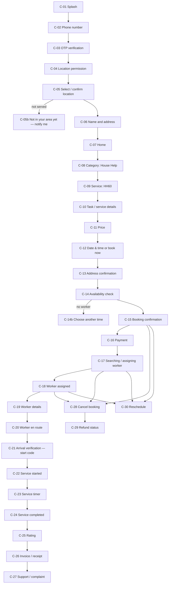
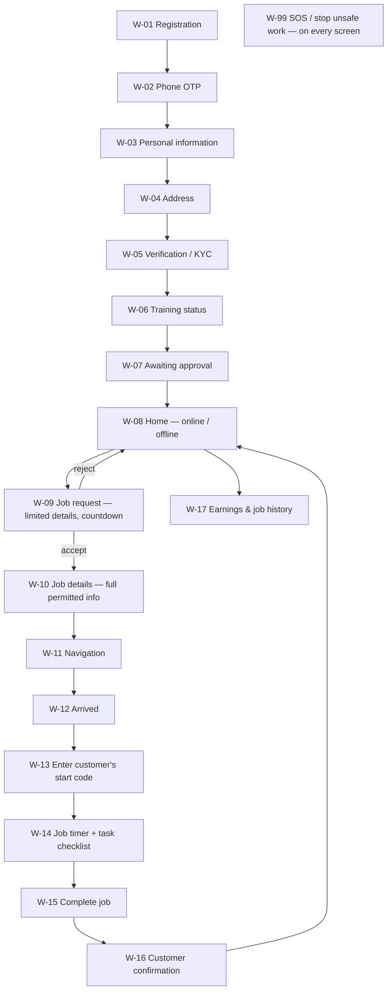

# One Tappe — UI/UX Screen Map

Status: **v0.3 — the HH60 journey is built** in all three apps and browser-tested end to
end (`e2e/tests/journey.spec.ts`, `e2e/tests/admin.spec.ts`); what remains per app is in
[10-system-matrix.md](10-system-matrix.md). Screen IDs are used in tickets, designs and
tests. Every screen exists in **English and Hindi**.

---

## 1. Principles

1. **Honest status.** The app shows the booking's real status and, when a time changed, both the
   original and the new time.
2. **Emergency is never behind a form.** "Emergency? Call 112" is reachable from every customer
   and worker screen; the worker app has an SOS button that opens a safety incident.
3. **Only what the role needs.** Workers see limited job details before accepting and the full
   address only after; admin screens mask phone numbers and addresses unless the staff member
   has the permission.
4. **Mobile-first, low bandwidth.** Large tap targets, clear icons with labels, works on slow
   networks; retries are safe (idempotency keys).
5. **Accessible.** WCAG 2.2 AA contrast, screen-reader labels, status never shown by colour alone.

---

## 2. Customer app (Android / iOS, React Native + Expo)

| ID   | Screen                 | API behind it (planned)                        | Notes                                                                           |
| ---- | ---------------------- | ---------------------------------------------- | ------------------------------------------------------------------------------- |
| C-02 | Phone number           | `POST /v1/auth/otp`                            | +91 default; rate-limited.                                                      |
| C-03 | OTP verification       | `POST /v1/auth/otp/verify`                     | Creates the account on first login; stores device for push.                     |
| C-05 | Select location        | `GET /v1/serviceability?lat&lng&pincode`       | Uses city/zone/locality/radius from the database.                               |
| C-07 | Home                   | `GET /v1/catalog?lat&lng`                      | Only services active in the resolved zone; names in the user's language.        |
| C-10 | Task / service details | `GET /v1/services/{id}`                        | Tasks with defaults; customer reorders priorities.                              |
| C-11 | Price                  | `POST /v1/quotes`                              | Full breakdown: base, charges, promo, GST, total.                               |
| C-12 | Date & time / now      | `GET /v1/availability?service&date&address`    | Only times with a free verified worker are selectable.                          |
| C-14 | Availability check     | part of `POST /v1/bookings`                    | The booking call itself holds the worker; `NO_AVAILABILITY` → C-14b.            |
| C-15 | Booking confirmation   | `POST /v1/bookings`                            | Sends expected total + idempotency key; shows "pay within 10 minutes".          |
| C-16 | Payment                | `POST /v1/bookings/{id}/payment` → gateway SDK | Confirmation comes from the verified gateway webhook, not from the app.         |
| C-17 | Assigning worker       | `GET /v1/bookings/{id}` + push                 | Shows progress; if no worker accepts, the customer is told and offered options. |
| C-19 | Worker details         | `GET /v1/bookings/{id}`                        | First name, photo, worker code, verification badge; no personal address.        |
| C-20 | En route               | booking status + worker location (duty-only)   | ETA labelled as an estimate.                                                    |
| C-21 | Arrival verification   | `GET /v1/bookings/{id}/start-code`             | "Share this code only after checking the worker's ID. It is not a payment OTP." |
| C-23 | Service timer          | booking status                                 | Counts from the recorded start.                                                 |
| C-25 | Rating                 | `POST /v1/bookings/{id}/rating`                | 1–5 and comment; a low rating opens a follow-up, never an automatic penalty.    |
| C-26 | Invoice                | `GET /v1/bookings/{id}/invoice`                | PDF from the correct issuing entity.                                            |
| C-27 | Support                | `POST /v1/support-cases`                       | Category, description, desired resolution; safety concerns go to safety.        |
| C-28 | Cancel                 | `POST /v1/bookings/{id}/cancel`                | Shows the refund outcome before confirming.                                     |
| C-30 | Reschedule             | `POST /v1/bookings/{id}/reschedule`            | Shows original and new time; the original promise is kept on record.            |

---

## 3. Worker app (Android / iOS, React Native + Expo)

| ID   | Screen             | Rules                                                                                                                                    |
| ---- | ------------------ | ---------------------------------------------------------------------------------------------------------------------------------------- |
| W-05 | Verification / KYC | Uploads go to the restricted vault; the worker sees status per item (pending, verified, rejected + reason). No Aadhaar number is stored. |
| W-07 | Awaiting approval  | Worker can only go online after approval, required verifications and training.                                                           |
| W-09 | Job request        | Service, locality (not full address), time, duration, payout, travel estimate; countdown from the offer expiry.                          |
| W-10 | Job details        | Full address and customer first name only after acceptance; access notes; tasks in priority order.                                       |
| W-13 | Start code         | Five wrong attempts lock the job and alert operations.                                                                                   |
| W-17 | Earnings           | Per-job pay, travel, incentives, adjustments with reasons, payout status.                                                                |
| W-99 | SOS                | Creates a CRITICAL safety incident with location; operations and safety are alerted immediately.                                         |

---

## 4. Admin / operations panel (Next.js, desktop-first)

| Module                    | Main screens                                                                                                                  | Permission(s)                            |
| ------------------------- | ----------------------------------------------------------------------------------------------------------------------------- | ---------------------------------------- |
| Live board                | Bookings by status, unassigned, offers about to expire, late arrivals, open incidents                                         | `booking.read`                           |
| Bookings                  | List, detail (status history, schedule changes, price lines, assignments), manual booking, reassign, cancel, reschedule, hold | `booking.*`                              |
| Customers                 | List (masked), profile, addresses, bookings, cases                                                                            | `customer.read`, `customer.read_contact` |
| Workers                   | List, profile, status, service permissions, restrictions, shifts, earnings                                                    | `worker.*`, `availability.manage`        |
| Worker verification       | Queue, document viewer, approve / reject with reason                                                                          | `worker_verification.*`                  |
| Services & categories     | Categories, services, options, tasks, requirements, per-zone activation                                                       | `catalog.manage`                         |
| Service areas             | Cities, zones (map + radius), localities, pincodes, activate / deactivate                                                     | `service_area.manage`                    |
| Pricing                   | Price rules, charges, tax rates, payout rules — with a "what would this cost?" preview                                        | `pricing.manage`                         |
| Promotions                | Codes, limits, scope, redemptions                                                                                             | `promotion.manage`                       |
| Payments & refunds        | Payments, gateway events, refund requests, second-person approval                                                             | `payment.read`, `refund.*`               |
| Worker earnings & payouts | Earnings, payout batches, approval                                                                                            | `payout.*`                               |
| Support                   | Case queue, SLA timers, conversation, resolution                                                                              | `support.*`                              |
| Safety                    | Incident queue by severity, commander, actions, independent closure                                                           | `safety.*`                               |
| Audit log                 | Filter by entity, actor, date; before/after view                                                                              | `audit.read`                             |
| Users & roles             | Staff accounts, roles (optionally per city), MFA status                                                                       | `user.manage`                            |

---

## 5. Design deliverables (after the API endpoints)

1. Design tokens (brand colours, type, spacing), light and dark.
2. Component library shared by the admin panel (web) and, as specifications, by the mobile apps.
3. Clickable prototype of the HH60 path across the three apps.
4. English and Hindi copy deck for every screen, notification and error code.
