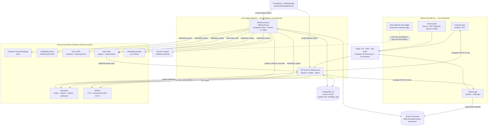

# One Tappe — Architecture, sources of truth and integrations

Status as of 23 Sep 2026. This document describes what is built in this repository, not
intentions. Where something is not built yet it says so, and
[10-system-matrix.md](10-system-matrix.md) carries the full status.

## 1. Components

- **One codebase, two processes.** The API answers requests. The worker runs the scheduled
  jobs (expiry, offers, re-dispatch, notifications, payment reconciliation, refunds,
  settlement, integration delivery, Zoho pull, document scanning and retention). Both
  connect to the same database, and any number of copies can run: job leases and
  `FOR UPDATE SKIP LOCKED` stop two copies doing the same work.
- **PostgreSQL is the only store of business state.** Nothing that matters is held in
  memory, so a restart loses nothing. This is tested: a retried booking against a
  restarted process returns the original booking.
- **External calls happen outside database transactions.** A slow or failed provider
  cannot hold locks or roll back a booking. Every provider is reached through an outbox
  (notifications, Zoho) or a reconciliation job (Razorpay, documents).

## 2. Source of truth per data type

| Data                                                          | Source of truth                                                         | Copies / mirrors                               | Direction                                                                    |
| ------------------------------------------------------------- | ----------------------------------------------------------------------- | ---------------------------------------------- | ---------------------------------------------------------------------------- |
| Customers, workers, staff, roles, permissions                 | PostgreSQL                                                              | Zoho CRM contact (customers only, for support) | One Tappe → CRM                                                              |
| Service areas, catalogue, prices, taxes, payouts, promotions  | PostgreSQL (audited admin APIs)                                         | —                                              | —                                                                            |
| Bookings, schedule, status history, assignments, reservations | PostgreSQL                                                              | Zoho CRM booking record (optional module)      | One Tappe → CRM                                                              |
| Worker availability, shifts, presence                         | PostgreSQL                                                              | —                                              | —                                                                            |
| Payments and refunds                                          | Razorpay (money) + PostgreSQL (our record)                              | —                                              | Razorpay → One Tappe only through verified webhooks or server-side fetch     |
| Invoices, credit notes, worker earnings                       | PostgreSQL (append-only)                                                | —                                              | —                                                                            |
| Support cases                                                 | PostgreSQL (case, category, booking link)                               | Zoho Desk ticket (the agents' workspace)       | Case → ticket once; ticket status → case (fetched, not trusted from webhook) |
| Safety incidents / SOS                                        | PostgreSQL (full record)                                                | Zoho Desk reference ticket (no narrative)      | One Tappe → Desk                                                             |
| Chat conversations                                            | Zoho SalesIQ                                                            | escalated chats become Desk tickets            | SalesIQ → Desk                                                               |
| Notifications sent                                            | PostgreSQL outbox                                                       | provider delivery reports (not yet ingested)   | One Tappe → providers                                                        |
| Worker identity documents                                     | Private S3 object + PostgreSQL record (hash, scan result)               | —                                              | —                                                                            |
| Audit trail                                                   | PostgreSQL `audit_log` (append-only; runtime role cannot update/delete) | backups                                        | —                                                                            |

Zoho never decides anything about a booking, a payment, an assignment or a price. A
Zoho outage delays the mirror and the ticket, never a booking. This is tested
(`zoho-integration.test.ts`: "a Zoho outage never blocks bookings or support cases").

## 3. Zoho boundary

| Product  | Used for                                                               | Built                                                                                          |
| -------- | ---------------------------------------------------------------------- | ---------------------------------------------------------------------------------------------- |
| CRM      | Customer relationship view for support; optional booking records       | Upsert by One Tappe id (`duplicate_check_fields`), coalesced per customer/booking              |
| Desk     | Complaints, refunds disputes, service issues, safety reference tickets | Ticket per case with case/booking/customer references; status read back from Zoho              |
| SalesIQ  | Live chat in the customer app                                          | Not built. It is a client-side widget/SDK, added with the customer app; escalations go to Desk |
| Mail     | Transactional email                                                    | ZeptoMail adapter (Zoho's transactional mail service)                                          |
| People   | HR for staff                                                           | Not integrated. No booking-flow need; workers are managed in One Tappe                         |
| Projects | Internal project tracking                                              | Not integrated. No product need                                                                |

How delivery works (`apps/api/src/integrations/`):

1. The business transaction writes an `integration_event` row in the same database
   transaction (for example, a support case is opened). If the transaction rolls back,
   nothing is sent.
2. The `deliver-integration-events` job claims due events with `FOR UPDATE SKIP LOCKED`
   and a 120-second lease. Events for the same record go in order.
3. Before creating a ticket it searches Zoho for our case code, so a lost response never
   creates a second ticket.
4. Retries back off at 1, 5, 15, 60, 180, 360 and 720 minutes. After 8 attempts the event
   is parked as `DEAD`.
5. Rate limits (429), rejected credentials and missing configuration pause the target
   without spending attempts. Five consecutive failures open the circuit for 5 minutes.
6. OAuth: one shared access token, stored encrypted and refreshed under a row lock, so many
   processes never exceed Zoho's token limit.
7. Desk webhook: the shared key is required. The body is treated only as a hint. The
   ticket is then fetched from Zoho and mapped to our status. A 10-minute pull catches
   webhooks that never arrive.
8. Operations see and act on all of this at `/admin/integrations`: status, events, retry,
   discard and resume. Each action is audited, and metrics and alerts cover it too.

## 4. Payments boundary (Razorpay)

- The server creates the Razorpay order. The customer app never sends an amount.
- A booking becomes paid only from:
  - a webhook whose signature is valid on the raw bytes, or
  - the server fetching the payment from Razorpay (the customer's "I have paid" refresh
    and the reconciliation job).
- An authorized-only payment is captured by the server. A booking whose payment is
  authorized is not expired during a 30-minute grace period.
- Webhooks are stored once per gateway event id. Duplicates, late events and out-of-order
  events are handled. For example, a failure arriving after a capture does not undo the
  payment.
- A payment arriving after its booking expired is refunded automatically.
- Refunds are created server-side, with dual approval and fresh MFA for completed
  bookings.
- The provider interface allows more methods later, such as UPI intent, cash collection
  or pay-after-service. Cash is not built, as decided.

Production configuration is in [08-provider-setup.md](08-provider-setup.md).

## 5. Following one booking through the system

Every request gets an `x-request-id` (the client's id when well-formed). It is written to:

- every log line;
- every audit and history row;
- every integration event;
- the job run that handled it.

Log lines inside a booking operation also carry the `bookingId`.

`GET /admin/bookings/:id/trace` (permission `booking.read`) returns, for one booking, in
time order:

**customer → booking → payments and gateway events → assignments and worker → status
history → notifications → support cases → integration events (Zoho ticket ids) → audit
rows**

Each entry carries the request id, so one search in the log store finds everything that
happened in that request.

## 6. Failure behaviour (tested)

| Scenario                                           | Behaviour                                                                                                                               | Test                                                    |
| -------------------------------------------------- | --------------------------------------------------------------------------------------------------------------------------------------- | ------------------------------------------------------- |
| PostgreSQL down / failover / network partition     | 503 `TEMPORARILY_UNAVAILABLE` with Retry-After; pool recovers by itself; worker keeps running                                           | `resilience.test.ts`                                    |
| Deadlock / serialization failure                   | Transaction retried (4 attempts, jittered)                                                                                              | `concurrency.test.ts`                                   |
| Two customers racing for one worker                | Exactly one reservation (database exclusion constraint)                                                                                 | `concurrency.test.ts`, `failure-journeys.test.ts`       |
| Two staff changing one booking                     | One wins; the other gets 409 `STALE_BOOKING` (version checked under the row lock)                                                       | `failure-scenarios.test.ts`                             |
| Repeated request (network retry)                   | Same result, nothing created twice (idempotency key + request hash)                                                                     | `failure-journeys.test.ts`, `failure-scenarios.test.ts` |
| Worker app loses signal and retries a step         | Retry succeeds without repeating anything; other people/steps still refused                                                             | `failure-scenarios.test.ts`                             |
| Customer loses signal during payment, webhook lost | Reopening the app asks Razorpay; booking confirmed once                                                                                 | `failure-scenarios.test.ts`                             |
| Duplicate / late / out-of-order gateway webhooks   | Processed once; late payment refunded; failure after capture ignored                                                                    | `failure-journeys.test.ts`                              |
| Razorpay unreachable                               | Checkout: 422 `PAYMENT_GATEWAY_UNAVAILABLE`, booking unchanged. Status check: 503 with Retry-After. Never marked paid on the app's word | `failure-scenarios.test.ts`                             |
| Zoho down / rate-limited / credentials revoked     | Bookings unaffected; events wait, pause or park; visible and resumable                                                                  | `zoho-integration.test.ts`                              |
| SMS / push / email provider failure                | Notification retried or marked failed; booking state untouched                                                                          | `notifications.test.ts`                                 |
| OTP provider failure                               | Code withdrawn, 503 `OTP_DELIVERY_FAILED`, no cooldown spent                                                                            | `auth.test.ts`                                          |
| Server restart mid-flow                            | State is in PostgreSQL; retries with the same key return the original                                                                   | `failure-scenarios.test.ts`                             |
| Worker process crash                               | Job leases and integration leases expire; another process continues                                                                     | `failure-scenarios.test.ts`, `zoho-integration.test.ts` |
| Malware in an upload / scanner down                | File deleted and verification withdrawn / files wait, never shown unscanned                                                             | `malware-scan.test.ts`                                  |
